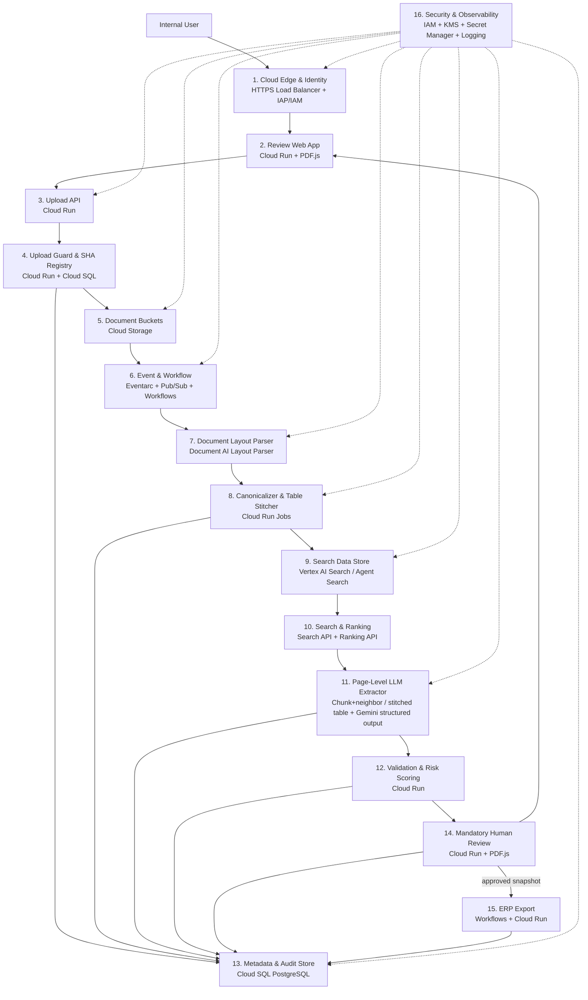

# Architecture Blueprint — Google Cloud Native Variant

**Candidate:** Volodymyr Dudavskyi  
**Task chosen:** 9 — Industrial Technical-Document Extraction Pipeline  
**Date:** 2026-08-17

This is the fully managed Google Cloud alternative to the portable design in
[`architecture_blueprint.md`](architecture_blueprint.md). It optimizes for operational simplicity,
elastic scaling, managed document understanding, and a single cloud security boundary. It is a
researched production design, not a locally benchmarked implementation.

---

## 1. Scope

The system receives industrial tenders and technical documents, identifies their layout and
evidence, retrieves the few relevant passages, produces typed candidate data, requires a human
review, and exports a versioned JSON snapshot for ERP staging.

- In scope:
  - PDF, TIFF, PNG, and JPEG upload with SHA-256 duplicate detection.
  - Native, scanned, and mixed documents, including layout and complex tables.
  - Page/block/table/cell evidence with coordinates retained for UI highlighting.
  - Search by text, headings, table titles, table rows, and document metadata.
  - Schema-constrained extraction, deterministic validation, mandatory review, and ERP export.
- Out of scope:
  - Automatic acceptance of commercial or technical obligations.
  - Direct writes to ERP production tables.
  - Training a custom OCR or language model in the first release.
- Assumptions:
  - The selected Google Cloud region and processor versions satisfy company residency policy.
  - A part master and business validation rules are available.
  - Reviewers approve every result before export.
  - Cost examples below are planning estimates in USD, not a Google quote.

---

## 2. Architecture Overview



Walkthrough:

1. **Cloud Edge & Identity** terminates HTTPS and limits the application to authenticated,
   authorized company users.
2. **Review Web App** uploads documents, reports asynchronous status, renders the source with
   PDF.js, highlights evidence, and provides typed editing controls.
3. **Upload API** validates the request, creates a processing run, returns `202 Accepted`, and
   never holds the HTTP request open during parsing.
4. **Upload Guard & SHA Registry** verifies MIME type, size, malware policy, and SHA-256. An exact
   match reuses a compatible result; a new pipeline or schema version creates a separate run.
5. **Document Buckets** keep immutable originals, quarantined uploads, page previews, canonical
   JSON, and approved exports under separate lifecycle and access policies.
6. **Event & Workflow** starts idempotent stages, isolates retries with Pub/Sub, and sends exhausted
   events to a dead-letter topic.
7. **Document Layout Parser** runs Document AI Layout Parser once to obtain OCR, reading order,
   headings, tables, and initial layout-aware chunks for native and scanned content.
8. **Canonicalizer & Table Stitcher** converts Document AI output to the shared evidence schema and
   applies deterministic cross-page table continuation rules. Original fragments remain immutable.
9. **Search Data Store** imports the canonical evidence chunks as structured records with
   `document_id`, page range, section path, element type, evidence IDs, and normalized text.
10. **Search & Ranking** filters to the current document, runs queries for each required field
    family, retrieves a broad semantic/lexical pool, optionally ranks it, and keeps the top three
    seed pages per family plus explicitly linked table continuations.
11. **Page-Level LLM Extractor** sends a narrower, structure-aware context per field family to a
    configurable Gemini model through Vertex AI, drawn from those pages instead of their full text:
    the top-ranked chunk plus its immediate neighboring chunk for non-table content, or the
    complete stitched table for table content (`spike/src/benchmark/context_assembly.py`). The
    model locates facts inside that context and must return the complete candidate JSON matching
    the response schema. It never sees ERP credentials and cannot approve a record.
12. **Validation & Risk Scoring** checks JSON Schema, types, units, currencies, totals, ranges,
    evidence references, part-master matches, and conflicts; it computes review risk.
13. **Metadata & Audit Store** records documents, runs, hashes, stage status, prompt/model/schema
    versions, candidate data, edits, approvals, and export receipts in Cloud SQL PostgreSQL.
14. **Mandatory Human Review** shows every candidate beside its exact page and bounding box;
    reviewers correct values and explicitly approve a versioned snapshot.
15. **ERP Export** serializes the approved snapshot to the shared contract and submits it to a
    staging adapter or stores a downloadable JSON file. Production ERP writes remain out of scope.
16. **Security & Observability** provides least-privilege service accounts, CMEK where required,
    managed secrets, audit logs, traces, dashboards, budgets, and alerts across all components.

---

## 3. Components

Names in this table exactly match the numbered diagram and walkthrough.

| Component | Responsibility | Production notes |
|---|---|---|
| **1. Cloud Edge & Identity — HTTPS Load Balancer + IAP/IAM** | TLS, identity, authorization | No public unauthenticated business endpoint; organization groups map to uploader/reviewer/admin roles. |
| **2. Review Web App — Cloud Run + PDF.js** | Upload and evidence review | Use signed, short-lived access to previews; never expose a whole bucket. |
| **3. Upload API — Cloud Run** | API and job creation | Stateless container, request IDs, idempotency keys, OpenAPI contract. |
| **4. Upload Guard & SHA Registry — Cloud Run + Cloud SQL** | File policy and exact deduplication | Unique key includes tenant, SHA-256, parser version, pipeline version, and output schema version. |
| **5. Document Buckets — Cloud Storage** | Immutable source and generated artifacts | Separate quarantine/source/derived/export buckets; retention and lifecycle per data class. |
| **6. Event & Workflow — Eventarc + Pub/Sub + Workflows** | Durable orchestration | At-least-once delivery means every stage must be idempotent. |
| **7. Document Layout Parser — Document AI Layout Parser** | OCR and layout extraction | Use a pinned processor version. Validate preview/global-endpoint residency before production. |
| **8. Canonicalizer & Table Stitcher — Cloud Run Jobs** | Shared evidence JSON and logical tables | Preserve raw Document AI response and every source fragment; do not use an LLM as the default stitch decision. |
| **9. Search Data Store — Vertex AI Search / Agent Search** | Managed searchable evidence index | The current pricing page calls the product Agent Search. Import already canonicalized chunks to avoid a second uncontrolled parse. |
| **10. Search & Ranking — Search API + Ranking API** | Top-three seed pages per field family and linked continuation selection | Always filter by `tenant_id` and `document_id`; use Standard Search plus separate extraction for control. |
| **11. Page-Level LLM Extractor — Chunk+neighbor / stitched table + Gemini structured output** | Assembled chunk/stitched-table context to complete candidate JSON | Model ID is configuration, not architecture. Require response schema, evidence IDs, and abstention. |
| **12. Validation & Risk Scoring — Cloud Run** | Deterministic safety checks | Invalid, missing, conflicting, or low-evidence fields are review blockers, not silently repaired values. |
| **13. Metadata & Audit Store — Cloud SQL PostgreSQL** | Workflow state and audit | Private IP, HA/backups/PITR for production, append-only audit events, no PDF bytes in relational rows. |
| **14. Mandatory Human Review — Cloud Run + PDF.js** | Verification and correction | Optimistic locking; record old/new value, reviewer, timestamp, reason, and evidence. |
| **15. ERP Export — Workflows + Cloud Run** | Approved JSON hand-off | Idempotent export key and receipt; staging first; retry only safe transport errors. |
| **16. Security & Observability — IAM + KMS + Secret Manager + Logging** | Cross-cutting controls | VPC Service Controls if required, no secrets in images/logs, redaction, SLOs, billing budgets. |

---

## 4. Canonical Evidence and ERP Contract

Both architecture variants use the same vendor-neutral contracts:

- [`contracts/extraction_candidate_v1.schema.json`](contracts/extraction_candidate_v1.schema.json)
  is the exact structured-output contract returned by the page-level LLM.
- [`contracts/extraction_candidate_v1.example.json`](contracts/extraction_candidate_v1.example.json)
  is a complete candidate response example.
- [`contracts/industrial_document_v1.schema.json`](contracts/industrial_document_v1.schema.json)
  is the strict approved ERP-export schema.
- [`contracts/industrial_document_v1.example.json`](contracts/industrial_document_v1.example.json)
  is an example valid export.

The canonical evidence layer is separate from the final ERP record. Each block, table, row, and
cell contains a stable `evidence_id`, source `document_id`, one-based page number, normalized
bounding box, text, element type, section path, and parser confidence. A logical table additionally
lists all contributing fragment and cell evidence IDs.

The extractor returns the candidate schema, not prose:

```json
{
  "schema_version": "industrial-document/1.0",
  "document": {
    "document_number": {"value": "DE-SOL-0011206", "evidence_ids": ["ev-p1-b4"]},
    "parties": [],
    "deadlines": [],
    "line_items": []
  },
  "validation_issues": [],
  "abstained_fields": []
}
```

Only values supported by supplied evidence IDs are accepted. `null` or an abstention is preferable
to invention. The application then resolves those IDs to page/bbox evidence, validates the result,
and maps it to the final contract after human approval.

---

## 5. Key Decisions and Alternatives

| Decision | Selected Google-native approach | Alternative and reason not selected as default |
|---|---|---|
| Document parsing | Document AI Layout Parser once | Enterprise OCR is cheaper for simple scans but does not provide the full table/heading hierarchy. Form Parser is three times the list price per page and targets key-value pairs/simple tables. |
| Search ingestion | Import canonical structured evidence chunks | Letting Agent Search parse the same PDF again duplicates parsing, weakens schema control, and can make evidence IDs diverge. |
| Retrieval | Agent Search Standard semantic search, document filter, optional Ranking API | Enterprise generative answers combine search and generation but give less control over the exact ERP schema and add query cost. |
| Table continuation | Deterministic stitcher in Cloud Run Jobs | Layout Parser improves tables, but cross-page fragments still need a document-domain decision and reversible provenance. LLM adjudication is allowed only for a flagged review suggestion. |
| Final extraction | Retrieve top-three pages per field family plus continuations (unchanged); Gemini reads a narrower chunk-plus-neighbor context for non-table content, or the whole stitched table (with a merge-confidence check) for table content, instead of each page's full text, and returns schema-constrained JSON; deterministic rules validate it | GLiNER failed the local quality gate; no specific model version is hard-coded because quality, residency, and price change. Selected on real-document evidence (see the matching subsection in [`architecture_blueprint.md`](architecture_blueprint.md) and [`docs/decision_log.md`](docs/decision_log.md)); sending each page's full text is kept only as a fallback until a live LLM extraction-accuracy comparison is run. |
| State and audit | Cloud SQL PostgreSQL | Search index and Cloud Storage are not transactional workflow/audit databases. |
| Compute | Cloud Run services and jobs | GKE adds cluster operations that this moderate asynchronous workload does not initially need. |
| Approval | Mandatory human review | Autonomous export is unsafe for prices, quantities, tolerances, and deadlines. |

The full tested/not-tested decision history is in [`docs/decision_log.md`](docs/decision_log.md).

---

## 6. Failure Handling and State

State machine:

```text
UPLOADED -> QUARANTINED -> PARSING -> CANONICALIZING -> INDEXING
         -> RETRIEVING -> EXTRACTING -> VALIDATING -> NEEDS_REVIEW
         -> APPROVED -> EXPORTING -> EXPORTED
```

Every stage may enter `FAILED_RETRYABLE` or `FAILED_TERMINAL`. Each handler uses
`document_id + run_id + stage + version` as its idempotency key. Workflow retries use bounded
exponential backoff; Pub/Sub dead-letter topics retain exhausted messages. A parser timeout,
unsupported file, schema violation, evidence mismatch, or conflicting table continuation becomes a
visible review/operations event rather than a fabricated result.

---

## 7. Security and Production Controls

- Separate dev/test/prod projects and service accounts; deny cross-tenant search by construction.
- Encrypt source, canonical, and export buckets; use CMEK when policy requires customer-managed
  keys and document the key-recovery procedure.
- Keep Cloud Run and Cloud SQL private where practical; use private service access and controlled
  egress. Store API secrets only in Secret Manager.
- Evaluate the exact Document AI processor version and Vertex AI endpoint for regional processing
  and data-residency requirements; some preview Gemini Layout Parser versions use a global endpoint.
- Never log PDF text, prompts, model responses, signed URLs, or ERP credentials at info level.
- Track parse latency/pages, extraction cost/document, search latency, validation failures, reviewer
  corrections, evidence coverage, and export failures. Alert on error budgets and billing budgets.

---

## 8. Cost Model (Illustrative, USD)

Prices were checked on 2026-08-17. Region, endpoint, discounts, free quotas, token size, index
expansion, retention, networking, logging, and support change the bill. Recalculate in the official
calculator before approval.

List-price drivers:

| Service | Planning unit | List-price basis used |
|---|---:|---:|
| Document AI Layout Parser | 1,000 pages | $10.00 |
| Document AI Form Parser or Custom Extractor | 1,000 pages | $30.00; alternative, not added on every page |
| Agent Search Standard | 1,000 queries | $1.50 |
| Agent Search index storage | GiB-month | about $5.00 after 10 GiB free |
| Ranking API | 1,000 requests | $1.00, up to 100 records/request |
| Gemini 3.5 Flash-Lite global standard | 1M input / output tokens | $0.30 / $2.50 |
| Gemini 3.5 Flash global standard | 1M input / output tokens | $1.50 / $9.00 |
| Cloud Run instance-based CPU / RAM | vCPU-second / GiB-second | $0.000018 / $0.000002; free tier applies |
| Cloud Storage regional Standard example | GiB-month | approximately $0.02 plus operations |
| Cloud SQL | instance, storage, backups, network | Region/configuration dependent; calculate separately |

Example monthly workload:

- 3,000 documents, average 20 pages = 60,000 pages.
- 8 search and ranking requests per document = 24,000 of each.
- 8,000 input and 1,500 output tokens per document = 24M input and 4.5M output tokens.
- 100 GiB Agent Search index, 100 GiB Cloud Storage.
- Cloud Run work totals 120 seconds/document at 2 vCPU and 4 GiB RAM; no minimum instances.

| Item | Calculation | Approx. monthly cost |
|---|---:|---:|
| Layout parsing | 60,000 / 1,000 × $10 | $600.00 |
| Standard search | 24,000 / 1,000 × $1.50 | $36.00 before trial quota |
| Ranking | 24,000 / 1,000 × $1.00 | $24.00 |
| Agent Search index | (100 - 10 free) GiB × $5 | $450.00 |
| Gemini 3.5 Flash-Lite | 24 × $0.30 + 4.5 × $2.50 | $18.45 |
| Gemini 3.5 Flash comparison | 24 × $1.50 + 4.5 × $9.00 | $76.50 |
| Cloud Run compute | usage minus listed free CPU/RAM tiers | about $11.88 |
| Cloud Storage | 100 GiB × about $0.02 | about $2.00 plus operations |
| Subtotal with Flash-Lite | excludes Cloud SQL, logging, network, support | **about $1,142/month** |

The listed variable-service subtotal is therefore roughly **$1,142/month, or $0.38/document, plus
Cloud SQL, logging, network, and support**. A round-number pilot budget of `$1.2k/month` is plausible
only with a very small database/observability footprint; production HA sizing can make it higher.
Use the Cloud SQL calculator after selecting region, CPU/RAM, HA, storage, backup, and traffic—the
official price depends on all of them. The two dominant measured items in this example are layout
parsing and indexed storage. Form Parser on all 60,000 pages would be $1,800 by itself and is not
included alongside Layout Parser. The 10,000-query Agent Search trial quota can reduce an
experiment, but production economics should not depend on a trial.

Cost controls:

1. Check SHA-256 before Document AI and reuse compatible parsing runs.
2. Parse once and import canonical chunks; do not enable a second parser at search ingestion.
3. Set retention/lifecycle rules and measure actual indexed GiB before projecting scale.
4. Retrieve a small evidence set, cache repeated field queries, and cap LLM input/output tokens.
5. Use budgets/alerts and labels per environment and document run.

---

## 9. Build and Verification Sequence

1. Provision separate project, IAM groups, service accounts, KMS policy, buckets, Cloud SQL, and
   network controls with Terraform.
2. Deploy **Upload API** and **Review Web App** containers to Cloud Run; verify MIME, SHA-256,
   idempotency, signed preview access, and tenant isolation.
3. Configure **Event & Workflow** and a pinned **Document Layout Parser**; run a representative
   parsing evaluation with native, scan, mixed, multi-column, and multi-page-table documents.
4. Implement **Canonicalizer & Table Stitcher** against golden Document AI responses; verify every
   source fragment/cell is preserved exactly once and every evidence ID resolves to page/bbox.
5. Create the **Search Data Store**, import canonical structured chunks, and evaluate Recall@K and
   MRR using the labelled queries from the local spike.
6. Add **Search & Ranking** and compare Standard Search with/without Ranking API for quality,
   latency, and cost. Keep ranking optional unless its measured gain justifies it.
7. Implement **Page-Level LLM Extractor** against the versioned candidate schema; evaluate exact field,
   relation, numeric/unit, and evidence accuracy on real documents. Do not infer success from
   synthetic examples.
8. Add **Validation & Risk Scoring**, adversarial tests, malformed-model responses, and explicit
   abstention/conflict paths.
9. Complete **Mandatory Human Review** and **ERP Export**; run an audit replay proving which source,
   model/prompt/schema, edit, reviewer, and approved snapshot produced each export.
10. Load-test the full asynchronous path, validate SLOs and failover, verify residency/security,
    compare the measured monthly bill with this estimate, and only then approve production rollout.

Release gates include evidence coverage for every non-null critical field, no unresolved schema or
business validation errors, retrieval quality on representative documents, acceptable reviewer
correction rate, deterministic replay, and a successful security/cost review.

---

## 10. References

- [Document AI Layout Parser documentation](https://docs.cloud.google.com/document-ai/docs/layout-parse-chunk)
- [Document AI pricing](https://cloud.google.com/products/document-ai/pricing)
- [Agent Search parsing and chunking](https://docs.cloud.google.com/generative-ai-app-builder/docs/parse-chunk-documents)
- [Create an Agent Search data store](https://docs.cloud.google.com/generative-ai-app-builder/docs/create-data-store-es)
- [Agent Search overview](https://docs.cloud.google.com/generative-ai-app-builder/docs/about-generic-search)
- [Agent Search pricing](https://cloud.google.com/generative-ai-app-builder/pricing)
- [Vertex AI generative model pricing](https://cloud.google.com/vertex-ai/generative-ai/pricing)
- [Cloud Run pricing](https://cloud.google.com/run/pricing)
- [Cloud Storage pricing](https://cloud.google.com/storage/pricing)
- [Cloud SQL pricing](https://cloud.google.com/sql/pricing)
